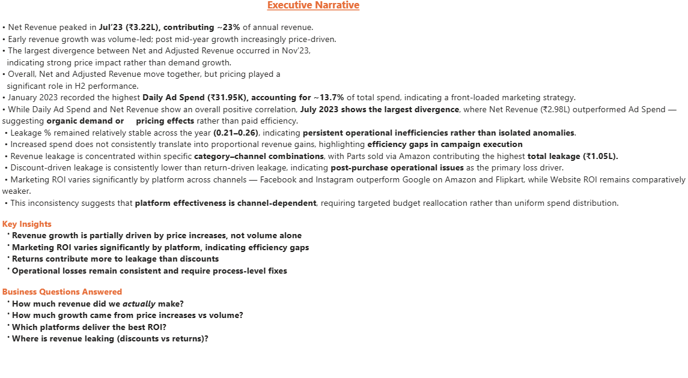

# 📊 Revenue, Marketing ROI & Leakage Analysis (Power BI)

## 📌 Business Problem
Organizations often see revenue growth but struggle to understand **what is real growth vs price-driven**, whether **marketing spend is efficient**, and **where revenue leaks operationally**.

This project builds an **executive-grade Power BI dashboard** to analyze:
- True revenue performance
- Pricing vs volume-driven growth
- Marketing ROI by platform & channel
- Revenue leakage from discounts and returns
- Operational inefficiencies hidden behind topline numbers

---

## ❓ Key Business Questions Answered
- How much revenue did we *actually* make?
- How much growth came from **price increases vs volume**?
- Which marketing platforms deliver the **best ROI**?
- Where is revenue leaking — **discounts or returns**?
- Which **categories, platforms, and channels** are risk-heavy?

---

## 🧠 Executive Summary
- **Net Revenue peaked in Jul’23 (₹3.22L)**, contributing ~23% of annual revenue.
- Early growth was **volume-led**, while **H2 growth became price-driven**.
- The **largest divergence between Net and Adjusted Revenue occurred in Nov’23**, indicating pricing impact rather than demand growth.
- **Marketing ROI varies significantly by platform**, highlighting efficiency gaps.
- **Returns contribute more to leakage than discounts**, pointing to post-purchase operational issues.
- Leakage % remains **stable (0.21–0.26)**, suggesting persistent process inefficiencies rather than isolated issues.

---

## 🗂️ Dashboard Pages

### 1️⃣ Executive Summary
High-level KPIs and narrative insights for leadership decision-making.

---

### 2️⃣ KPI & Trends
Core revenue, pricing, and growth KPIs with time-based trends.

**Includes**
- Net Revenue
- Adjusted Revenue (After Price Changes)
- Price Impact
- Daily Ad Spend
- Marketing ROI
- MoM Revenue Growth %

---

### 3️⃣ Trends & Drivers
Explains *why* performance changed — efficiency vs volume vs pricing.

**Includes**
- Ad Spend vs Net Revenue
- Operational Loss Trend
- Revenue Leakage Breakdown
- Leakage Source Comparison

---

### 4️⃣ Leakage by Category / Platform
Deep-dive into where revenue is being lost operationally.

**Insights**
- Returns are the dominant leakage driver
- Certain category–channel combinations are high risk
- Leakage is structurally consistent across months

---

### 5️⃣ Platform → Channel Drill-through
Interactive drill-through to trace performance from platform to channel.

**Purpose**
- Identify which platforms drive revenue into which channels
- Compare ROI, revenue, and leakage together
- Support targeted budget reallocation

---

## 🧱 Data Model Overview
- **Fact Table**
  - Sales_Fact (Revenue, Quantity, Discounts, Returns)
- **Dimension Tables**
  - Calendar
  - Products
  - Web_Product_Map
  - Ads_Campaigns
  - Price_Changes
- **Model Design**
  - Star schema
  - Explicit DAX measures only
  - Logical measure folders:
    - Revenue
    - Volume
    - Pricing
    - Leakage
    - Growth
    - Marketing

---

## 📐 Key Metrics Defined
- **Net Revenue** – Actual realized revenue
- **Adjusted Revenue** – Revenue after cumulative price changes
- **Price Impact** – Revenue driven purely by pricing
- **True Growth** – Volume-driven growth
- **Marketing ROI** – Revenue per unit of ad spend
- **Leakage %** – Operational revenue loss ratio

---

## 🛠️ Tools & Techniques Used
- Power BI Desktop
- DAX (MoM, cumulative pricing, ROI, leakage metrics)
- Star schema data modeling
- Custom tooltips for attribution clarity
- Drill-through design for deep analysis
- Executive narrative storytelling

## Outcome
Delivered an executive-ready dashboard that explains **what happened, why it happened,
and where action is needed**.

## 👤 Author
**Lakshmi Pathi**  
Aspiring Data Analyst  
